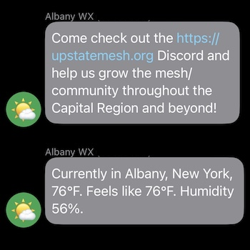

A Meshtastic/LoRa-based bot for beaconing, announcements, and weather condition reporting with Home Assistant connected sensors. Fully configurable to have as many or as few channel outputs of any type you'd like.

## Requirements

* A meshtastic device connected to the machine you intend to run the script on, with any required USB serial drivers pre-installed.
* Something unix-ish to run the script on (Linux, Mac OS etc). It might work in windows but ymmv. 
* Python 3 and Pip 3.
* Probably something to keep the script running in the background e.g. `tmux`, `screen`, `pm2` etc.

## Usage

* Connect your device via USB.
* One time: `cp config.sample.yml config.yml`
* One time: `pip3 install -r requirements.tsx`
* As needed: Edit `config.yml` to have the worker jobs you desire.
* Run `python3 main.py`
* Enjoy!

### Example sent messages

## Security and privacy

While Meshtastic uses encryption on private channels, public channels are unencrypted. A good best practice is to never send anything truly sensitive on any channel, but that's up to your personal level of privacy.

This project is not affilated with Meshtastic®, nor endorsed by Meshtastic LLC.

## License

Apache 2.0 license, see `LICENSE.md` for more information.
